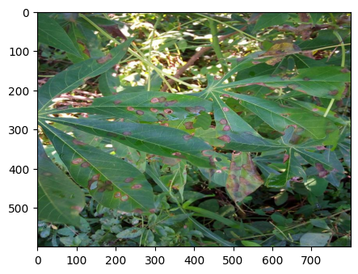
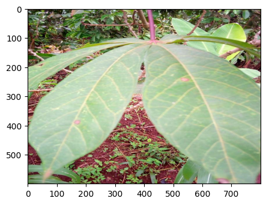
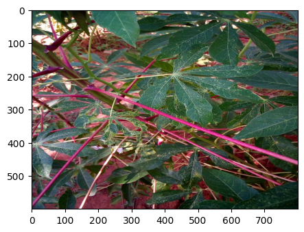
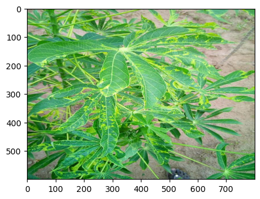
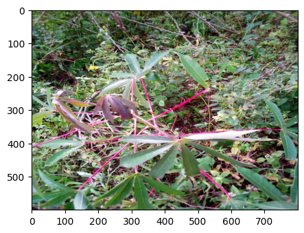
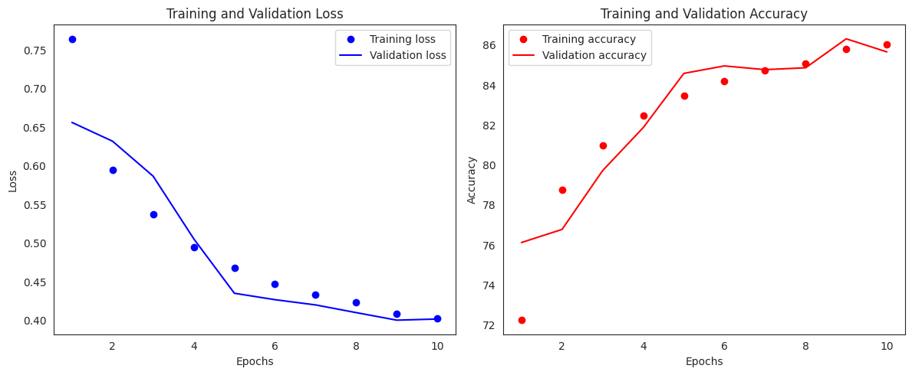

# DeepLearning_Projects

Here are few of the projects that I've worked on and their results!

---
---
# 1. Leaf Disease Classification
---
This is an attempt to work of the problem stated on [Kaggle](https://www.kaggle.com/competitions/cassava-leaf-disease-classification) platform.

## Table of Contents
1. [Project Overview](#project-overview)
2. [Motivation](#motivation)
3. [Dataset Description](#dataset-description)
4. [Usage](#usage)
5. [Model Training](#model-training)
6. [Results](#results)

## Project Overview
This project aims to classify cassava leaf images into four disease categories or a healthy leaf category using machine learning techniques. Cassava is a crucial crop in Africa, providing a major source of carbohydrates. However, viral diseases significantly affect yields. This project leverages data science to help farmers quickly and accurately identify diseased plants using photos taken with mobile-quality cameras.

## Dataset Description
The dataset consists of 21,367 labeled images collected from a survey in Uganda. Most images were crowdsourced from farmers' gardens and annotated by experts at the National Crops Resources Research Institute (NaCRRI) in collaboration with the AI lab at Makerere University, Kampala. The dataset realistically represents the diagnostic conditions that farmers face.

    "0":"Cassava Bacterial Blight (CBB)"

    "1":"Cassava Brown Streak Disease (CBSD)"

    "2":"Cassava Green Mottle (CGM)"

    "3":"Cassava Mosaic Disease (CMD)"

    "4":"Healthy"

## Model Training
This repository contains code for training an image classification model for leaf images using PyTorch. The model is based on a pretrained ResNet18 architecture, and the training function tracks both loss and accuracy for the training and validation datasets. The repository also includes data augmentation using Albumentations.
- **LeafModel**
The LeafModel class defines the neural network architecture using a pretrained ResNet18 model. It customizes the final fully connected layer to match the number of classes for the classification task.
- **LeafImageDataset**
The LeafImageDataset class handles loading and preprocessing of the image data, including applying augmentations.
- **Train Method**
The train function handles the training loop, including updating weights, computing metrics, and applying early stopping.

### Features
- **Model Architecture**: Based on ResNet18 with a customizable final layer for the number of classes.

- **Data Augmentation**: Uses Albumentations for various augmentation techniques.

- **Training and Validation Loss Tracking**: Monitors loss for both datasets.

- **Accuracy Calculation**: Computes accuracy for both training and validation datasets.

- **Early Stopping**: Prevents overfitting based on validation loss.

- **Scheduler Integration**: Adjusts the learning rate during training.

## Results
### Training Loss and Accuracy:

The training loss consistently decreased from 0.764 in the first epoch to 0.403 in the tenth epoch.
The training accuracy improved steadily from 72.24% to 86.05% over the 10 epochs.
### Validation Loss and Accuracy:

The validation loss showed a decreasing trend, starting at 0.656 in the first epoch and reaching 0.402 by the tenth epoch.
Validation accuracy improved from 76.12% in the first epoch to 85.65% in the final epoch.
### Observations
- The model demonstrates significant improvements in both training and validation accuracy, indicating effective learning and generalization over the training period.
- The consistent decrease in both training and validation loss suggests that the model is not overfitting, as the validation performance is closely following the training performance.

### Visualization
To better understand the training progress, you can visualize the losses and accuracies using the provided plot_metrics function. This will help in visually analyzing the trends and identifying any potential issues or improvements.

---
---

# 2. Dogs and Cats Classification
---
This project is part of the competition on [Kaggle](https://www.kaggle.com/competitions/dogs-vs-cats/) platform.

## Table of Contents
1. [Project Overview](#project-overview)
2. [Motivation](#motivation)
3. [Dataset Description](#dataset-description)
4. [Files](#files)
5. [Installation](#installation)
6. [Usage](#usage)
7. [Model Training](#model-training)
8. [Evaluation](#evaluation)
9. [Results](#results)
10. [Contributing](#contributing)
11. [License](#license)

## Project Overview
This project involves building a machine learning model to classify images as either containing a dog or a cat. While this task is straightforward for humans, it poses significant challenges for computers. The project is based on the Asirra (Animal Species Image Recognition for Restricting Access) dataset, which consists of images provided by Petfinder.com.

## Motivation
Asirra was originally created as a CAPTCHA to distinguish between humans and automated systems by asking users to identify images of cats and dogs. The goal of this project is to benchmark the latest computer vision and deep learning techniques in image classification, aiming to achieve high accuracy in distinguishing between dogs and cats.

## Dataset Description
The dataset used in this project is a subset of the Asirra dataset provided by Petfinder.com. It contains a total of 25,000 labeled images of dogs and cats for training purposes. The test set includes an additional 12,500 images that need to be classified.
